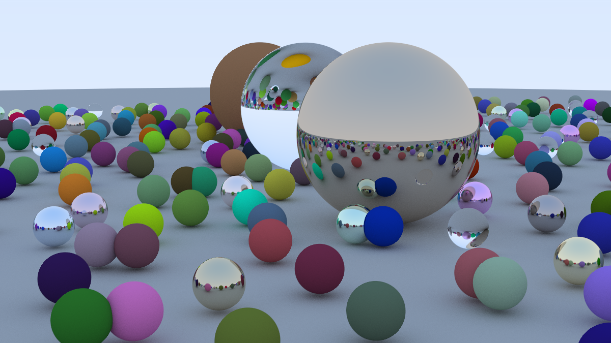

# A Simple Ray Tracer in Rust

A Rust implementation of the ray tracer from Peter Shirley's [Ray Tracing in One Weekend](https://raytracing.github.io/books/RayTracingInOneWeekend.html).

>NOTE: Rendering without multithreading or async support will take really a long time.
